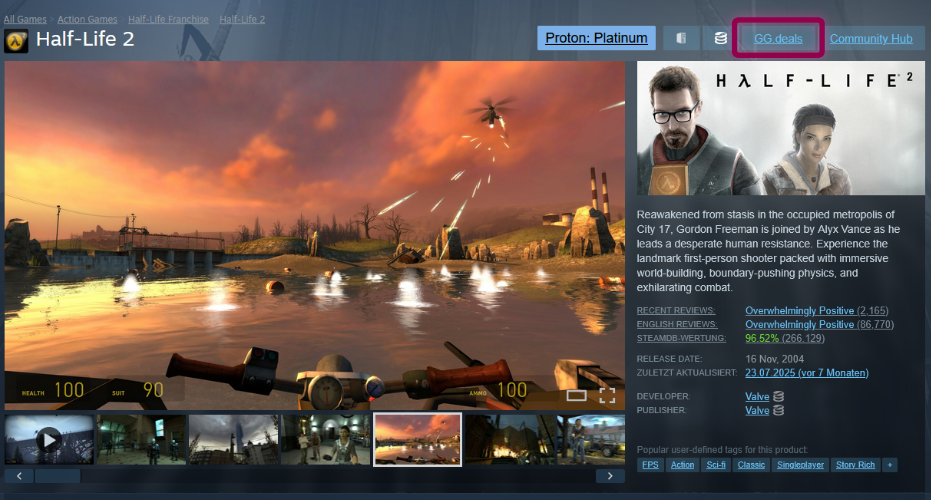
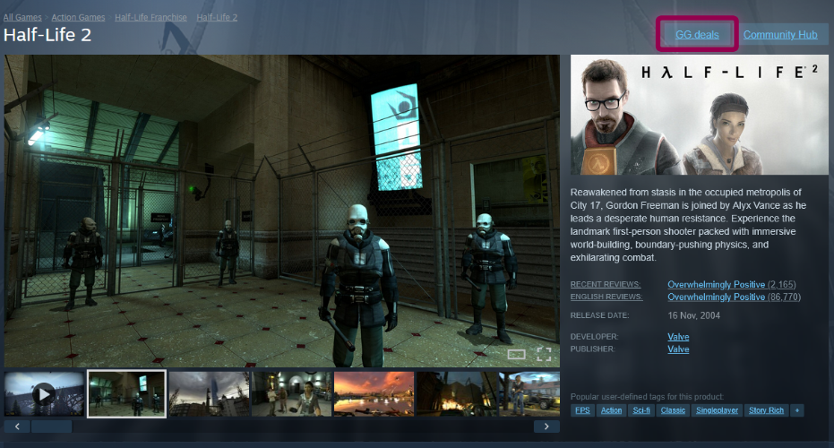
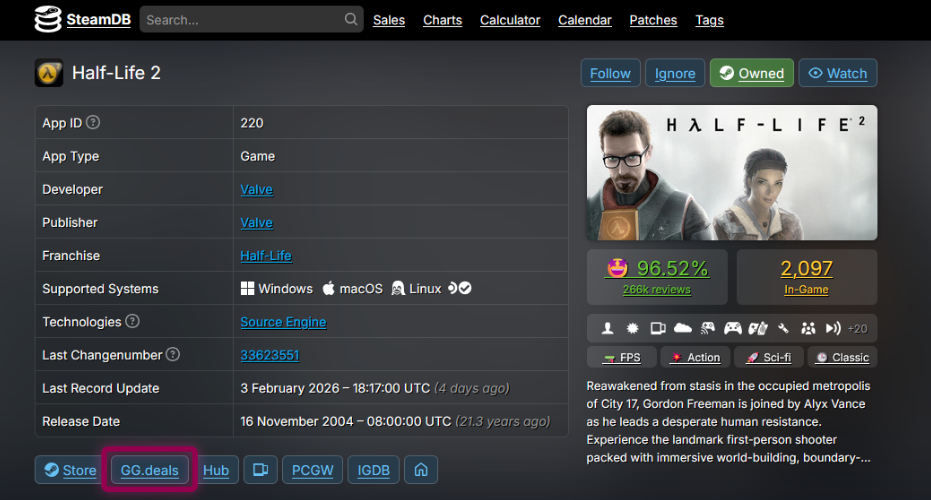
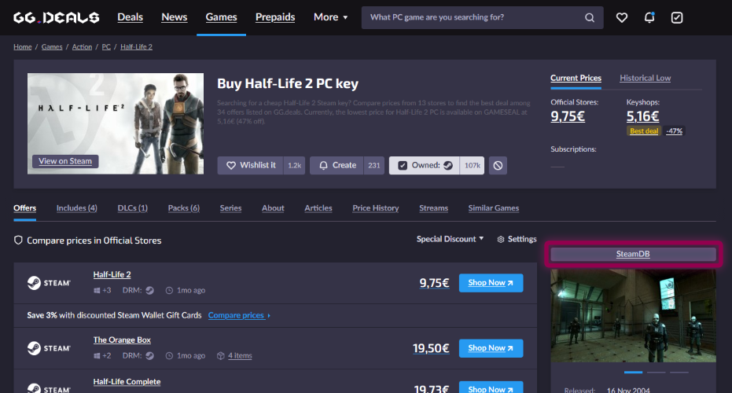

# GG.deals-Button
Adds a button to SteamDB and Steam Store pages to search for games on GG.deals.

Get it now on Firefox Add-ons [GG.deals-Button](https://addons.mozilla.org/de/firefox/addon/gg-deals-button/)!

You should always use the version from the Firefox Add-ons Store, as this is either the more stable or the more up-to-date version.
(This Add-on is not affiliated with GG.deals, SteamDB or Steam by VALVE)

# Screenshots

